# B1W2 Final Report: The Automaton Auditor
### Autonomous Code Governance Swarm — LangGraph Implementation

**Author:** Zerubabel Jemaneh
**Repository:** https://github.com/Zerubabel-J/autonomous-code-governance-swarm-langgraph
**Submission Date:** February 28, 2026
**Final Self-Audit Score:** 4.8 / 5.0 — Master Thinker

---

## Table of Contents

1. [System Overview](#1-system-overview)
2. [Theoretical Foundations](#2-theoretical-foundations)
3. [Architecture Decision Rationale](#3-architecture-decision-rationale)
4. [StateGraph Architecture Diagrams](#4-stategraph-architecture-diagrams)
5. [Self-Audit Results](#5-self-audit-results)
6. [Peer Audit Results](#6-peer-audit-results)
7. [MinMax Reflection](#7-minmax-reflection)

---

## 1. System Overview

The Automaton Auditor is a hierarchical multi-agent swarm built on LangGraph that forensically audits AI-generated code repositories. The system implements a **Digital Courtroom** pattern:

- **Detective agents** collect structured forensic evidence from a target repository and PDF report
- **Judge agents** deliberate with adversarial personas (Prosecutor, Defense, TechLead) in parallel
- **Chief Justice** synthesizes a deterministic final verdict using pure Python rules before any LLM call

**Input:** GitHub repository URL + optional PDF report
**Output:** Structured Markdown audit report scored against a 10-criterion rubric

| Layer | Nodes | Responsibility |
|-------|-------|---------------|
| Detective | RepoInvestigator, DocAnalyst, VisionInspector | Evidence collection |
| Judicial | Prosecutor, Defense, TechLead | Dialectical scoring |
| Synthesis | EvidenceAggregator, ChiefJustice | Conflict resolution + report |

---

## 2. Theoretical Foundations

### 2.1 Fan-Out / Fan-In (Parallel Dispatch and Convergence)

**Fan-out** is the pattern where a single node dispatches work to multiple parallel nodes simultaneously. In this system, the `START` node fans out to both `repo_investigator` and `vision_inspector` concurrently, and `evidence_aggregator` fans out to all three judge nodes (`prosecutor`, `defense`, `techlead`) in parallel.

**Fan-in** is the convergence pattern where multiple parallel branches are synchronized before the next stage proceeds. The `evidence_aggregator` node acts as the detective fan-in point — it only executes after both `doc_analyst` and `vision_inspector` complete, using LangGraph's list-edge syntax `add_edge(["doc_analyst", "vision_inspector"], "evidence_aggregator")`. Similarly, `chief_justice` is the judge fan-in — it receives opinions from all three judges before synthesizing.

**Architectural significance:** Without explicit fan-in synchronization, a downstream node would execute as soon as the first upstream node completes, processing incomplete evidence. LangGraph's list-edge syntax enforces barrier semantics — all listed predecessors must complete before the successor fires.

### 2.2 Dialectical Synthesis

**Dialectical synthesis** is the process of resolving contradictions between opposing positions to arrive at a higher-order truth. In classical philosophy (Hegel), a thesis is opposed by an antithesis, and their tension produces a synthesis.

In this system, the three judge personas embody thesis/antithesis tension by design:
- **Prosecutor (Thesis):** Adversarial — assumes the worst, requires explicit evidence of compliance
- **Defense (Antithesis):** Charitable — rewards intent and partial compliance
- **TechLead (Synthesis mediator):** Pragmatic — evaluates only what the evidence confirms

The **ChiefJustice** performs the dialectical synthesis by applying deterministic rules (Rule of Security, Rule of Evidence, Rule of Functionality) to the three opposing opinions, producing a final score that is neither the highest nor the lowest opinion but a rule-anchored resolution. When variance between judges exceeds 2 points, a mandatory dissent summary is added to the report — making the dialectical tension visible rather than hiding it in an average.

### 2.3 Metacognition (Self-Awareness in Automated Systems)

**Metacognition** refers to a system's capacity to reason about its own reasoning — to evaluate the quality of its own outputs. In AI systems, metacognition is implemented through self-audit loops, confidence scoring, and structured self-reflection.

This system implements metacognition at three levels:

1. **Evidence confidence scores** — Every `Evidence` object carries a `confidence: float` field (0.0–1.0). The detective assigns lower confidence when evidence is partial (e.g., `has_basemodel=True` but `has_reducers=False` gives `confidence=0.7`), allowing judges to weight evidence quality rather than treating all findings as equally certain.

2. **Self-audit capability** — The system can audit its own repository by pointing `run_audit()` at its own GitHub URL. The self-audit score of 4.8/5 validates that the auditor's rubric criteria are correctly implemented in the auditor itself — a metacognitive consistency check.

3. **Dissent detection** — The ChiefJustice recognizes when it cannot achieve consensus (variance > 2) and documents the disagreement explicitly rather than silently averaging. This is metacognitive transparency — the system knows the limits of its own certainty.

### 2.4 State Synchronization

**State synchronization** is the mechanism by which concurrent processes writing to shared memory avoid data races, overwrites, and lost updates.

In LangGraph parallel topologies, multiple nodes execute simultaneously and all write to the same `AgentState` object. Without synchronization primitives, the last writer wins — earlier outputs are silently discarded.

This system solves state synchronization using LangGraph's `Annotated` reducer mechanism:

```python
class AgentState(TypedDict):
    evidences: Annotated[Dict[str, List[Evidence]], operator.ior]  # dict merge — no key collision
    opinions:  Annotated[List[JudicialOpinion], operator.add]       # list append — all opinions kept
```

- `operator.ior` performs a non-destructive dict merge: each detective writes under a namespaced key (`repo_investigator_git_forensic_analysis`, `doc_analyst_theoretical_depth`) so concurrent writes never collide.
- `operator.add` performs list concatenation: all three judges' opinions are appended, not overwritten, so ChiefJustice receives exactly 3 opinions per criterion.

**Architectural significance:** Naming key collisions structurally impossible (via namespacing) is stronger than locking — it eliminates the failure mode rather than protecting against it.

### 2.5 Adversarial Robustness via Persona Collusion Prevention

**Persona collusion** is the failure mode where multiple LLM agents, despite being assigned different roles, converge on identical reasoning because their system prompts share too much vocabulary or structure. Collusion defeats the purpose of a multi-agent system — it produces the appearance of independent deliberation without the substance.

This system prevents persona collusion by three structural constraints:
1. **Zero shared boilerplate** — each judge's system prompt is written from scratch with no shared text
2. **Conflicting analytical rules** — Prosecutor rules ("os.system confirmed: score MUST be 1") directly contradict Defense rules ("broken implementation but genuine effort: argue score 3 minimum")
3. **Automated test enforcement** — a test measures vocabulary overlap between judge prompts and fails if any two share more than 50% of unique words

---

## 3. Architecture Decision Rationale

### 3.1 LangGraph StateGraph over Custom Orchestration

LangGraph provides native parallel fan-out via multi-edge routing, typed state with reducer semantics, and a compiled graph that fails fast at build time. These properties directly enforce the audit system's correctness guarantees — a pipeline that crashes at compilation is safer than one that silently drops evidence at runtime.

### 3.2 Immutable Evidence via Pydantic `frozen=True`

```python
class Evidence(BaseModel):
    model_config = ConfigDict(frozen=True)
    goal: str
    found: bool
    location: str
    rationale: str
    confidence: float = Field(ge=0.0, le=1.0)
```

Freezing evidence objects ensures that what the detective found is exactly what every downstream node sees. No judge or aggregator can mutate the factual basis for another node's reasoning.

### 3.3 Deterministic Rules Before Any LLM Call (RISK-1)

The ChiefJustice applies four deterministic Python rules **before** invoking any LLM:

1. **Rule of Security** — Confirmed security violations (AST-detected `os.system` calls) cap score at 3
2. **Rule of Fact Supremacy** — Defense opinions citing unverified file locations are overruled to score 1
3. **Rule of Functionality Weight** — TechLead carries 50% weight for `graph_orchestration` criterion
4. **Dissent Requirement** — Score variance > 2 mandates an explicit dissent summary

### 3.4 AST-Based Forensic Detection over Regex

All forensic checkers use Python's `ast` module. A comment `# Do not use os.system()` would trigger a regex rule but not an AST walk — AST inspection detects only actual executable call nodes, eliminating false positives.

### 3.5 Sandboxed Repository Cloning (RISK-2)

```python
def clone_repo_sandboxed(url: str) -> tuple[TemporaryDirectory, Path]:
    tmpdir = tempfile.TemporaryDirectory()
    subprocess.run(["git", "clone", url, tmpdir.name], ...)
    return tmpdir, Path(tmpdir.name)
```

All git operations execute inside `tempfile.TemporaryDirectory()`. The cloned repo path is never the live working directory. No `os.system()` calls exist anywhere in the codebase.

### 3.6 Rubric as Constitution — Loaded at Runtime

No rubric criteria are hardcoded in agent prompts. All rubric content is loaded from `rubric.json` at module import:

```python
_RUBRIC: dict = json.loads(_RUBRIC_PATH.read_text(encoding="utf-8"))
_DIMENSIONS_BY_ID: dict[str, dict] = {d["id"]: d for d in _RUBRIC["dimensions"]}
```

This ensures every agent evaluates against the same version of the standard. The rubric is the system's "Constitution" — the single normative source of truth.

---

## 4. StateGraph Architecture Diagrams

### 4.1 Full Production Topology

```mermaid
flowchart TD
    START([START]) --> RI
    START --> VI

    RI["🔍 RepoInvestigator\nClones repo into tempfile sandbox\nRuns 5 AST forensic checks\nProduces Evidence × 5 criteria"]
    VI["👁️ VisionInspector\nExtracts PDF images\ngpt-4o-mini multimodal classification\nProduces Evidence × 1 criterion"]

    RI --> DA
    DA["📄 DocAnalyst\nDocling PDF text extraction\nTheoretical depth check\nCross-reference path verification\nProduces Evidence × 2 criteria"]

    DA --> EA
    VI --> EA

    EA["⚖️ EvidenceAggregator\nValidates all required evidence keys\nRoutes to judicial panel or forensic failure"]

    EA -->|judicial_panel| PR
    EA --> DE
    EA --> TL
    EA -->|forensic_failure| FF

    FF["🚨 ForensicFailure\nPartial evidence handler\nPasses state to ChiefJustice"]

    PR["⚔️ Prosecutor\nAdversarial — Trust No One\nJudicialOpinion × 8 criteria"]
    DE["🛡️ Defense\nCharitable — Reward Intent\nJudicialOpinion × 8 criteria"]
    TL["🔧 TechLead\nPragmatic — Judge Artifact\nJudicialOpinion × 8 criteria"]

    PR --> CJ
    DE --> CJ
    TL --> CJ
    FF --> CJ

    CJ["🏛️ ChiefJustice\n① Rule of Security\n② Rule of Fact Supremacy\n③ Rule of Functionality Weight\n④ Dissent Requirement\nProduces AuditReport"]

    CJ -->|done| END_NODE([END\nMarkdown Audit Report])

    style START fill:#2d5a27,color:#fff
    style END_NODE fill:#2d5a27,color:#fff
    style RI fill:#1a3a5c,color:#fff
    style VI fill:#1a3a5c,color:#fff
    style DA fill:#1a3a5c,color:#fff
    style EA fill:#5c3a1a,color:#fff
    style FF fill:#7a1a1a,color:#fff
    style PR fill:#7a1a1a,color:#fff
    style DE fill:#1a5c1a,color:#fff
    style TL fill:#1a4a5c,color:#fff
    style CJ fill:#2d1a5c,color:#fff
```



### 4.2 State Object Flow

```mermaid
flowchart LR
    subgraph Input
        A["repo_url: str"]
        B["pdf_path: str"]
        C["rubric_dimensions: List[Dict]"]
    end

    subgraph AgentState["AgentState — LangGraph TypedDict"]
        D["evidences: Dict[str, List[Evidence]]\n── operator.ior reducer ──\nKeys: detective_criterionid\nExample: repo_investigator_git_forensic_analysis"]
        E["opinions: List[JudicialOpinion]\n── operator.add reducer ──\nAll 3 judges appended, never overwritten"]
        F["final_report: Optional[AuditReport]"]
    end

    subgraph Output
        G["Markdown Audit Report\nScores per criterion\nJudge opinions\nDissent summaries\nRemediation plan"]
    end

    RI_N["RepoInvestigator\nDocAnalyst\nVisionInspector"] -->|writes 8 evidence keys| D
    JJ_N["Prosecutor\nDefense\nTechLead"] -->|appends 24 opinions| E
    CJ_N["ChiefJustice"] -->|writes| F
    F --> G
```



### 4.3 ChiefJustice Deterministic Rule Pipeline


### 4.4 Evidence Key Namespace Design

```mermaid
flowchart LR
    subgraph "evidences dict — operator.ior merge"
        K1["repo_investigator_git_forensic_analysis"]
        K2["repo_investigator_state_management_rigor"]
        K3["repo_investigator_graph_orchestration"]
        K4["repo_investigator_safe_tool_engineering"]
        K5["repo_investigator_structured_output_enforcement"]
        K6["doc_analyst_theoretical_depth"]
        K7["doc_analyst_report_accuracy"]
        K8["vision_inspector_swarm_visual"]
    end

    RI["RepoInvestigator"] --> K1
    RI --> K2
    RI --> K3
    RI --> K4
    RI --> K5
    DA["DocAnalyst"] --> K6
    DA --> K7
    VI["VisionInspector"] --> K8
```



---

## 5. Self-Audit Results

The system audited its own repository on February 28, 2026. LangSmith trace available in the project's audit directory.

### 5.1 Final Score: 4.8/5 — Master Thinker

| Criterion | Score | All Judges | Notes |
|-----------|-------|-----------|-------|
| Git Forensic Analysis | **5/5** | 5-5-5 | 29 commits, clear iterative progression |
| State Management Rigor | **5/5** | 5-5-5 | Pydantic BaseModel + TypedDict + reducers confirmed |
| Graph Orchestration Architecture | **5/5** | 5-5-5 | Full fan-out/fan-in + conditional edges confirmed |
| Safe Tool Engineering | **5/5** | 5-5-5 | tempfile sandbox + subprocess.run + error handling confirmed |
| Structured Output Enforcement | **5/5** | 5-5-5 | .with_structured_output(JudicialOpinion) + retry logic confirmed |
| Theoretical Depth (Documentation) | **4/5** | 4-5-4 | 4 terms with substantive explanation |
| Report Accuracy (Cross-Reference) | **4/5** | 1-5-5 | Defense overruled; 2/3 judges confirmed 100% path accuracy |
| Architectural Diagram Analysis | **5/5** | 5-5-5 | LangGraph StateGraph topology with fan-out/fan-in confirmed |
| **Overall** | **4.8/5** | | **Master Thinker** |

### 5.2 Score Progression

| Run | Score | Key Fix |
|-----|-------|---------|
| Initial (single judge, Phase 1) | 2.6/5 | Baseline — no parallel judges |
| With PDF + parallel topology | 3.1/5 | Added PDF, DocAnalyst sequential after RI |
| After all bug fixes | 4.2/5 | Security rule fix, fan-in topology fix |
| Final (all fixes + LangSmith) | 4.8/5 | rubric.json cross-ref fix, vision prompt fix |

---

## 6. Peer Audit Results

### 6.1 Our Audit of Peer (leuel-a/automaton-auditor): 3.1/5

Conducted against `https://github.com/leuel-a/automaton-auditor` without PDF (not available).

| Criterion | Score | Finding |
|-----------|-------|---------|
| Git Forensic Analysis | 5/5 | 8 meaningful commits with clear progression |
| State Management Rigor | 5/5 | Full Pydantic + TypedDict + reducers |
| Graph Orchestration Architecture | 5/5 | Full fan-out/fan-in with conditional edges |
| Safe Tool Engineering | 5/5 | tempfile + subprocess, no os.system() |
| Structured Output Enforcement | 2/5 | No `.with_structured_output()` detected |
| Theoretical Depth | 1/5 | No PDF provided |
| Report Accuracy | 1/5 | No PDF provided |
| Architectural Diagram | 1/5 | No PDF provided |
| **Overall** | **3.1/5** | Strong repo implementation, PDF criteria absent |

**Key finding:** The peer's code implementation is solid (5/5 on all repo criteria). The score gap is entirely due to absent PDF documentation. The one genuine gap is the lack of `.with_structured_output()` binding in judge nodes.

### 6.2 Peer's Audit of Us (received): 3.8/5

The peer's auditor evaluated our repository and produced 3.8/5. Key findings:

| Criterion | Their Score | Notes |
|-----------|-------------|-------|
| Git Forensic Analysis | 5/5 | Strong iterative history confirmed |
| State Management Rigor | 5/5 | Full compliance confirmed |
| Graph Orchestration | 4/5 | Noted missing conditional edges (pre-fix version) |
| Safe Tool Engineering | 5/5 | Zero security findings |
| Structured Output | 4/5 | No retry logic detected (pre-fix version) |
| Judicial Nuance | 3/5 | Could not verify prompt uniqueness from evidence |
| Chief Justice | 4/5 | Deterministic rules confirmed, some gaps noted |
| Theoretical Depth | 2/5 | Missing "Dialectical Synthesis", "Metacognition", "State Synchronization" |
| Report Accuracy | 4/5 | All paths verified, feature claims noted |
| Architectural Diagram | 2/5 | Vision model (Qwen2.5-VL) unavailable on their system |

The 3.8/5 reflects the **pre-fix version** of our repository at the time of their audit. The conditional edges and retry logic gaps they identified were the exact bugs fixed in subsequent commits.

---

## 7. MinMax Reflection

### 7.1 What the System Got Right (Maximize)

**Structural correctness of the dialectical pattern.** The three-judge design with deterministic ChiefJustice synthesis proved robust. Once the security rule false positive was fixed, scores across all repo criteria reached 5/5 unanimously — demonstrating that well-constructed evidence leads to consensus across adversarial personas.

**AST-based detection.** Using `ast.walk()` rather than regex eliminated false positives that would have degraded the audit quality. The `os.system` detection correctly ignores comments and docstrings, which is critical for a system whose outputs are used for scoring.

**State synchronization design.** The `operator.ior` + namespaced key pattern proved correct — no evidence was lost or overwritten across any parallel run. This is a design the team would replicate in any future multi-agent system.

### 7.2 What the System Got Wrong (Minimize)

**The security rule scoped globally, not per-criterion.** The biggest bug was `apply_security_rule()` scanning all evidences globally. A rationale saying "No raw os.system() calls" in the safe_tool criterion triggered the security cap on every other criterion. This capped 7 out of 8 criteria at 3/5 and cost the system two full audit runs to diagnose. Root cause: the rule was written assuming it would only be called when relevant, but the call site passed the entire evidence dict without filtering.

**DocAnalyst ran in parallel before RI evidence existed.** The cross-reference feature requires RepoInvestigator evidence (known file locations) to be present in state before DocAnalyst runs. Running them in parallel meant DocAnalyst always saw an empty evidence dict — marking every PDF file path as hallucinated. The fix (RI → DA → EA sequential path) required changing the graph topology, which is harder to test without a real repo + PDF.

**The `--depth=1` clone truncated git history.** The forensic tool cloned with `--depth=1` to save time, which fetched only 1 commit regardless of actual history. This caused every audited repo (including our own) to be flagged as a bulk upload. The fix was trivial (remove the flag) but the bug persisted across multiple test runs because the test suite mocked the clone function.

### 7.3 Forward Improvements

1. **Scope security rule to `safe_tool_engineering` criterion only** — the current fix (pass criterion-filtered evidence) is correct but implicit; a future version should make this explicit in the rule signature
2. **Add end-to-end integration test with a real small repo** — mock-heavy tests missed the `--depth=1` and parallel DA bugs; at least one test should clone a known fixture repo
3. **Extend theoretical depth detection** — add "Dialectical Synthesis", "Metacognition", "State Synchronization" to the `check_theoretical_depth` term list in `doc_tools.py` to close the 4/5 gap

---

*Final Report — B1W2 The Automaton Auditor — 10 Academy AI Mastery Program*
*GitHub: https://github.com/Zerubabel-J/autonomous-code-governance-swarm-langgraph*
*LangSmith Project: automaton-auditor*
