# B1W2 Interim Report: The Automaton Auditor
### Autonomous Code Governance Swarm — LangGraph Implementation

**Author:** Zerubabel Jemaneh
**Repository:** https://github.com/Zerubabel-J/autonomous-code-governance-swarm-langgraph
**Submission Date:** February 25, 2026
**Phase Completed:** Phase 1 (Linear PoC) + Phase 3 topology (parallel fan-out compiled)

---

## Table of Contents

1. [System Overview](#1-system-overview)
2. [Architecture Decision Rationale](#2-architecture-decision-rationale)
3. [StateGraph Architecture Diagram](#3-stategraph-architecture-diagram)
4. [Gap Analysis and Forward Plan](#4-gap-analysis-and-forward-plan)
5. [Self-Audit Results](#5-self-audit-results)

---

## 1. System Overview

The Automaton Auditor is a hierarchical multi-agent swarm built on LangGraph that forensically audits AI-generated code repositories. The system implements a **Digital Courtroom** pattern: Detective agents collect structured forensic evidence from a target repository, Judge agents deliberate with adversarial personas, and a Chief Justice synthesizes a deterministic final verdict with a Markdown audit report.

The system evaluates five rubric dimensions against a repository's source code:

| Dimension | What is Measured |
|-----------|-----------------|
| Git Forensic Analysis | Commit history, development progression, bulk upload detection |
| State Management Rigor | Pydantic BaseModel schemas, TypedDict, LangGraph reducers |
| Graph Orchestration Architecture | StateGraph topology, fan-out/fan-in patterns, aggregator presence |
| Safe Tool Engineering | Sandboxed execution, subprocess hygiene, os.system absence |
| Structured Output Enforcement | LLM schema binding via `.with_structured_output()` |

---

## 2. Architecture Decision Rationale

### 2.1 LangGraph StateGraph over Custom Orchestration

LangGraph was chosen over a custom orchestration loop because it provides native support for parallel fan-out via multi-edge routing, a typed state container with reducer semantics, and a compiled graph that fails fast at build time rather than runtime. These properties directly enforce the audit system's correctness guarantees — a pipeline that crashes at compilation is safer than one that silently drops evidence at runtime.

### 2.2 Immutable Evidence via Pydantic `frozen=True`

The `Evidence` schema is declared with `ConfigDict(frozen=True)`, making every evidence object immutable once created by the detective node:

```python
class Evidence(BaseModel):
    model_config = ConfigDict(frozen=True)
    goal: str
    found: bool
    content: Optional[str] = None   # Never passed to judges
    location: str
    rationale: str
    confidence: float = Field(ge=0.0, le=1.0)
```

**Rationale:** Trust in forensic evidence must be established at collection time and preserved thereafter. If judge nodes or aggregators could mutate evidence objects, a compromised or hallucinating judge could alter the factual basis for other judges' opinions. Freezing evidence ensures that what the detective found is exactly what every downstream node sees.

### 2.3 Deterministic Rules Before Any LLM Call (RISK-1 Mitigation)

The `ChiefJustice` node applies four deterministic Python rules before invoking any LLM for narrative text:

1. **Rule of Security** — If forensic evidence rationale contains security violation keywords (e.g., `os.system`), the criterion score is capped at 3. This cap is applied from AST tool output only — LLM opinion arguments are explicitly excluded to prevent false positives from adversarial phrasing.
2. **Rule of Fact Supremacy** — Defense opinions citing file locations not confirmed by detective evidence are overruled to score 1, regardless of argument quality.
3. **Rule of Functionality Weight** — The TechLead's score carries 50% weight for the `graph_orchestration` criterion, acting as a technical tie-breaker.
4. **Dissent Requirement** — When score variance across judges exceeds 2, a dissent summary is mandated in the final report.

**Rationale:** LLMs are non-deterministic and subject to hallucination. Anchoring all scoring to deterministic rules first ensures reproducible verdicts. The LLM is used only where creativity is appropriate — generating specific remediation advice — and never where correctness is required.

### 2.4 AST-Based Forensic Detection over Regex

All five forensic checkers use Python's `ast` module rather than string matching:

```python
def _has_os_system_call(source: str) -> bool:
    """Walk AST to detect actual os.system() call nodes only."""
    tree = ast.parse(source)
    for node in ast.walk(tree):
        if isinstance(node, ast.Call):
            if isinstance(node.func, ast.Attribute):
                if (isinstance(node.func.value, ast.Name) and
                        node.func.value.id == "os" and
                        node.func.attr == "system"):
                    return True
    return False
```

**Rationale:** Regex matching on source code produces false positives when security-relevant strings appear in comments, docstrings, or variable names. For example, a comment `# Do not use os.system()` would trigger a regex rule. AST walking inspects the actual program structure — only real function call nodes activate the security detection. This distinction is critical for a system whose outputs are used for automated scoring.

### 2.5 Three Adversarial Judge Personas (RISK-4 Mitigation)

Three judge nodes receive identical evidence but evaluate it from structurally different analytical postures:

| Judge | Mandate | Philosophy |
|-------|---------|------------|
| **Prosecutor** | Adversarial — find every gap | "Trust No One. Assume Vibe Coding." |
| **Defense** | Forgiving — reward intent and effort | "Reward effort. Look for the spirit of the law." |
| **TechLead** | Pragmatic — evaluate the artifact objectively | "Does it actually work? Judge the artifact, not the struggle." |

System prompts share less than 40% vocabulary overlap (enforced by automated test) to prevent persona collusion — a failure mode where all three judges converge on identical reasoning despite different personas.

**Rationale:** A single LLM judge exhibits anchoring bias — its first opinion on a codebase influences all subsequent evaluations. A dialectical bench surfaces genuine disagreement. When Prosecutor and Defense scores diverge by more than 2 points, the ChiefJustice is required to produce an explicit dissent summary, making the controversy transparent in the report.

### 2.6 Parallel-Safe State with `operator.ior` and `operator.add` Reducers

The `AgentState` uses LangGraph's `Annotated` field type to declare merge semantics for parallel writes:

```python
class AgentState(TypedDict):
    evidences: Annotated[Dict[str, List[Evidence]], operator.ior]   # dict merge
    opinions:  Annotated[List[JudicialOpinion], operator.add]        # list append
    final_report: Optional[AuditReport]
```

**Rationale:** In parallel fan-out topologies, multiple detective nodes and multiple judge nodes write to the same state dictionary simultaneously. Without reducers, LangGraph would overwrite each node's output with the last writer's value. `operator.ior` (dict merge by key) and `operator.add` (list concatenation) ensure all outputs are preserved. Evidence key namespacing (`"repo_investigator_{criterion_id}"`) makes `operator.ior` collisions structurally impossible even if multiple detectives run concurrently.

### 2.7 Rubric Loaded at Runtime from `rubric.json`

No rubric criteria, scoring patterns, or dimension names are hardcoded in any agent prompt. All rubric content is loaded from `rubric.json` at module import:

```python
_RUBRIC: dict = json.loads(_RUBRIC_PATH.read_text(encoding="utf-8"))
_DIMENSIONS_BY_ID: dict[str, dict] = {d["id"]: d for d in _RUBRIC["dimensions"]}
```

**Rationale:** Hardcoding rubric content in prompt strings creates divergence risk — the rubric evolves but prompts are forgotten. Loading from a single canonical source (`rubric.json`) ensures every agent evaluates against the same version of the standard. The rubric file acts as the project's "Constitution" — the normative source of truth for what constitutes correct implementation.

---

## 3. StateGraph Architecture Diagram

### 3.1 Phase 1 — Linear Topology (Implemented)

```mermaid
flowchart TD
    START([START]) --> RI
    RI["🔍 repo_investigator\nClones repo, runs 5 AST forensic checks\nProduces: Evidence × 5 criteria"]
    RI --> EA
    EA["⚖️ evidence_aggregator\nValidates all 5 evidence keys\nRaises ValueError on gaps"]
    EA --> PR
    PR["⚔️ prosecutor\nAdversarial judge — Trust No One\nProduces: JudicialOpinion × 5"]
    PR --> CJ
    CJ["🏛️ chief_justice\nSecurity rule · Fact supremacy\nFunctionality weight · Dissent\nProduces: AuditReport"]
    CJ --> END_NODE([END — Markdown Report])

    style START fill:#2d5a27,color:#fff
    style END_NODE fill:#2d5a27,color:#fff
    style RI fill:#1a3a5c,color:#fff
    style EA fill:#5c3a1a,color:#fff
    style PR fill:#5c1a1a,color:#fff
    style CJ fill:#2d1a5c,color:#fff
```



### 3.2 Phase 3 — Parallel Fan-Out Topology (Compiled, Phase 3 Activation)

```mermaid
flowchart TD
    START([START]) --> RI

    RI["🔍 repo_investigator\nDetective — AST forensic tools\nEvidence × 5 criteria"]

    RI --> EA

    EA["⚖️ evidence_aggregator\nCompleteness validation\nHard-block on missing keys"]

    EA --> PR
    EA --> DE
    EA --> TL

    PR["⚔️ Prosecutor\nAdversarial bench\nTrust No One"]
    DE["🛡️ Defense\nAdvocate bench\nReward Intent"]
    TL["🔧 TechLead\nPragmatic bench\nJudge Artifact"]

    PR --> CJ
    DE --> CJ
    TL --> CJ

    CJ["🏛️ chief_justice\nDeterministic rules\nSecurity cap\nFact supremacy\nFunctionality weight\nDissent requirement"]

    CJ --> END_NODE([END\nAuditReport.md])

    style START fill:#2d5a27,color:#fff
    style END_NODE fill:#2d5a27,color:#fff
    style RI fill:#1a3a5c,color:#fff
    style EA fill:#5c3a1a,color:#fff
    style PR fill:#7a1a1a,color:#fff
    style DE fill:#1a5c1a,color:#fff
    style TL fill:#1a4a5c,color:#fff
    style CJ fill:#2d1a5c,color:#fff
```



### 3.3 State Object Flow


---

## 4. Gap Analysis and Forward Plan

### 4.1 Current Phase Status

| Phase | Status | Scope |
|-------|--------|-------|
| Phase 1 — Linear PoC | ✅ Complete | Single detective + Prosecutor + ChiefJustice |
| Phase 2 — Test Suite | ✅ Complete | 74 tests, all passing, mocked LLM |
| Phase 3 — Parallel Judges | 🔶 Compiled, not activated | Defense + TechLead built; `build_graph(parallel=True)` available |
| Phase 4 — DocAnalyst | ❌ Not started | PDF/document forensic analysis |
| Phase 5 — VisionInspector | ❌ Not started | Multimodal swarm visual detection |

### 4.2 Gaps Identified by Self-Audit

The system audited itself (`run_audit` against its own GitHub repository) and produced an overall score of **2.6/5**. The self-audit reveals three concrete gaps:

**Gap 1: Git Forensic Analysis — Score 1/5**
- **Finding:** 8 commits pushed within a 1-minute window are classified as a bulk upload pattern. The forensic tool correctly detects `is_bulk_upload: True` based on timestamp compression.
- **Root cause:** All Phase 1 commits were created during a single development session and pushed simultaneously, which accurately matches the pattern the auditor is designed to flag.
- **Classification:** This is a process gap, not a code gap. The implementation is correct; the development workflow did not reflect iterative progression over time.
- **Forward plan:** Future phases (Phase 3, 4) will be developed across separate sessions with meaningful time gaps between commits, ensuring `has_progression: True` in the git forensic analysis.

**Gap 2: Safe Tool Engineering — Score 1/5 (Prosecutor adversarial over-penalization)**
- **Finding:** The Prosecutor confirmed `os.system()` calls are absent and acknowledged `tempfile.TemporaryDirectory()` and `subprocess.run()` are present, but scored 1/5 citing "absence of explicit error handling documentation" in evidence metadata.
- **Root cause:** The Prosecutor operates with adversarial rules ("Only award 4 or 5 if evidence EXPLICITLY confirms full compliance"). The forensic tool returns boolean flags but does not emit error handling confirmation, which gives the Prosecutor grounds to penalize.
- **Classification:** A known limitation of single-judge Phase 1. In Phase 3, the Defense would argue `subprocess.run(capture_output=True)` is the correct pattern and score 4-5, moderating the Prosecutor's position through ChiefJustice averaging.
- **Forward plan:** Enhance the `check_safe_tool_engineering` forensic tool to emit explicit `has_error_handling` and `has_capture_output` flags, giving the evidence layer sufficient detail to anchor judge scores.

**Gap 3: Structured Output Enforcement — Score 1/5 (LLM hallucination)**
- **Finding:** The Prosecutor stated: *"the implementation uses `.with_structured_output(JudicialOpinion)` in judge nodes, which is a clear violation of the structured output enforcement requirement."* The Prosecutor confused the presence of the pattern with a violation of it.
- **Root cause:** This is a direct LLM hallucination — the Prosecutor inverted the semantics of the evidence. Single-judge systems have no correction mechanism for this type of error.
- **Classification:** Structural limitation of Phase 1 single-judge design. Phase 3 dialectical bench is the designed solution — the TechLead's rules explicitly state "with_structured_output bound to JudicialOpinion: score 4 or 5."
- **Forward plan:** Activate `parallel=True` for Phase 3. This is the primary motivation for the multi-judge design — hallucinations from one persona are contradicted by structured reasoning from another.

### 4.3 Forward Implementation Plan

**Phase 3 — Activate Parallel Judges (Immediate next step)**
- Change `run_audit(parallel=True)` to enable Defense and TechLead nodes
- Expected impact: Safe Tool Engineering increases from 1/5 to 3-4/5; Structured Output Enforcement increases from 1/5 to 4/5; overall score increases from 2.6/5 to approximately 3.6-4.0/5
- Files: `src/graph.py` — single parameter change

**Forensic Tool Enhancement (Phase 3 support)**
- Add `has_error_handling`, `has_capture_output`, `return_code_checked` flags to `check_safe_tool_engineering`
- Add `has_retry_logic`, `has_fallback` flags to `check_structured_output_enforcement`
- These additional fields give judges richer evidence for precise scoring

**Phase 4 — DocAnalyst**
- Implement `src/tools/doc_tools.py` with PDF text extraction
- Wire `doc_analyst_node` as a parallel detective alongside `repo_investigator_node`
- Target criteria: `report_accuracy`, `theoretical_depth` (dimensions 6-10 in `rubric.json`)

---

## 5. Self-Audit Results

The system audited its own repository on February 25, 2026. Results are archived at `audit/report_onself_generated/audit.md`.

| Criterion | Score | Verdict |
|-----------|-------|---------|
| Git Forensic Analysis | 1/5 | Bulk upload pattern detected (8 commits in <1 min) |
| State Management Rigor | **5/5** | All Pydantic schemas, TypedDict, and reducers confirmed |
| Graph Orchestration Architecture | **5/5** | Parallel fan-out/fan-in with EvidenceAggregator confirmed |
| Safe Tool Engineering | 1/5 | Adversarial over-penalization (os.system confirmed absent) |
| Structured Output Enforcement | 1/5 | LLM hallucination (Prosecutor inverted evidence semantics) |
| **Overall** | **2.6/5** | **"Vibe Coder" — reflects Phase 1 single-judge limitation** |

The 2.6/5 score is expected and explainable. It demonstrates the system is functioning — the Prosecutor correctly identified State Management and Graph Orchestration as compliant (5/5), and the two low scores are attributable to known Phase 1 limitations (single adversarial judge, no dialectical correction mechanism) rather than implementation failures.

---

*Report generated for: B1W2 The Automaton Auditor — 10 Academy AI Mastery Program*
*GitHub: https://github.com/Zerubabel-J/autonomous-code-governance-swarm-langgraph*
